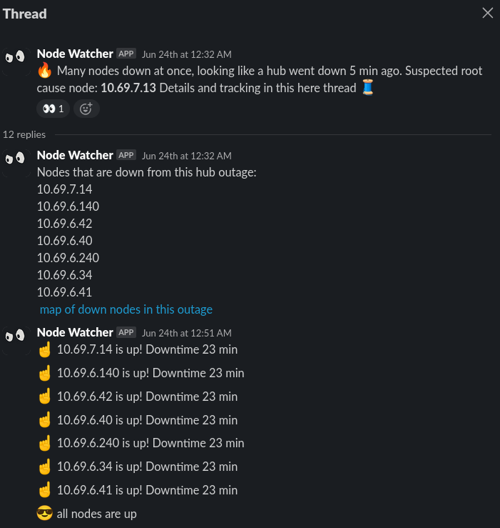
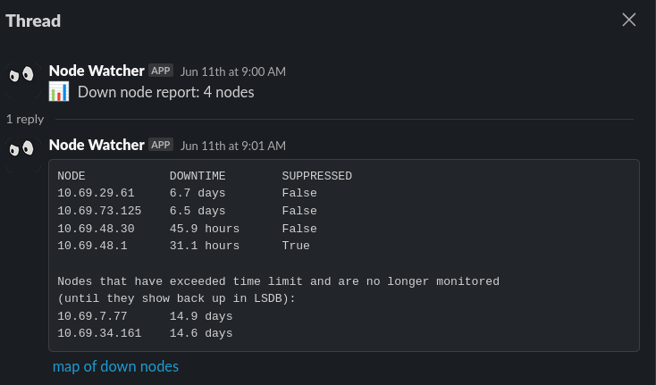

# Node-Watcher

Node-Watcher is a Slack application that monitors and reports the status of nodes in an OSPF network. It currently works with datasources that are specific to NYC Mesh, but the initiative to make it more generic is planned, and happens under the branch 'make-generic'

## Getting Started

### Dependencies

* Needs a Slack app with the following Oauth permissions in all channels it will be posting in: `chat:write`, `reactions:read`
* Python3, using built-in modules 
* Runs on Linux, tested on Ubuntu Server 24.04

### Pull and Config

* Pull the repo: `git clone git@github.com:scottongithub/node-watcher.git`
* Edit the environment variable situation in `node_watcher_launcher.sh` (info specific to your Slack environment)
* All tuneables are at the top of `node_watcher.py`, some separated by ('dev', 'prod') environments

### Execute

* Run `node_watcher_launcher.sh` - you will be prompted to paste in the bot's API token. It will then detach and run in the background
* Run `ps aux | grep node_watcher` to find its PID. Use `kill -9 <PID>` to stop it

## What it Does

Node-Watcher pulls the entire OSPF LSDB every 60 seconds. If a node is in the LSDB, and it's not being filtered (`Filters` section), then it gets monitored. Node-Watcher will report when a node is observed to be down for longer than the defined threshhold `alert_threshold_ms` (default 5 min), or when it is determined to be flappy (default 12 flaps over the course of 24 hours). The first time a node is observed as either down or flappy, a message for that node is created in the Node-Watcher channel:

This message will be the start of the node's history thread that will contain all future activity of the node. An example of a node's history thread with a bunch of observed state changes:

In addition to this node's history thread above, an additional message is added to the Node-Watcher channel for each state change of the node:

This additional message, in the main channel as opposed to inside the node's history thread, will be deleted when that node's state changes again, and the new message will replace it. This is done to minimize the amount of noise that a flappy node can produce. A node's *full* history is available by looking at the node's history thread, viewable by clicking the 'node history' link in the alert message

## Controlling the App with Reactions
Certain functionalities can be invoked by leaving reactions on the parent of a node's history thread, or on the node's alert message in the channel (but not messages *inside* the node's history thread):

:eyes: -> the user that left this will be @'ed on (only) the next alert message from this node  
:heart: -> the user that left this will be subscribed to all future alerts from this node  
:broken_heart: -> the user that left this will be _un_-subscribed to alerts from this node  
:stopwatch: -> silence all alerts from this node for 3 hours  
:date: -> silence all alerts from this node for 24 hours  
:x: -> silence all alerts from this node forever. remove the :x: to re-enable alerts from this node  

## Hub-down Events

When 5 or more nodes (set by`hub_down_node_qty`) go down, and stay down, past a time threshhold (`hub_down_alert_time_ms`, default 3 min), it's considered a hub-down outage and will look like this:

:fire::fire: **12** nodes down at once, looking like a hub went down 3 min ago. Suspected root cause node: **aa.bb.cc.dd**

Number of fire emojis is the number of down nodes/5 (rounded) so the above example has ~10 nodes down for 5 or more min. This hub-down message will serve as a thread for all info that pertains to the outage, e.g. when a node comes back up, when all nodes are back up etc:

While waiting for all nodes in a degraded hub to come back up, it may be useful to see a report of which of the hub's dependant nodes have not yet come back up. Place a :eyes: on the parent message of the hub-down thread and a report of still-down nodes will be posted to the thread every minute. Remove the :eyes: to stop the reporting.

### Hub-down Escalations
If 25 or more nodes (set by`hub_down_raise_qty`) go down at once, an additional escalation message is sent to `SLACK_ESCALATION_CHANNEL`, which is set in `node_watcher_launcher.sh`  

## Daily Report

Node-Watcher will send out a report every day at a set time (`reporting_hour`, `reporting_minute`) showing which nodes are down and for how long, along with which nodes are flappy and flap quantity over the past 24 hours:

Nodes that have been down for more than 14 days (set by `abandoned_threshold_ms`) will be removed from reporting and monitoring, until the node shows back up in the LSDB

## Acknowledgments

* NYC Mesh volunteers who help with testing, and for their practical and creative suggestions
* [@Andrew-Dickinson](https://www.github.com/Andrew-Dickinson) for providing OSPF data via [bird-ospf-link-db-parser](https://github.com/Andrew-Dickinson/bird-ospf-link-db-parser) and [node-explorer](https://github.com/Andrew-Dickinson/node-explorer)

## License

This project is licensed under the MIT License - see the LICENSE.md file for details

